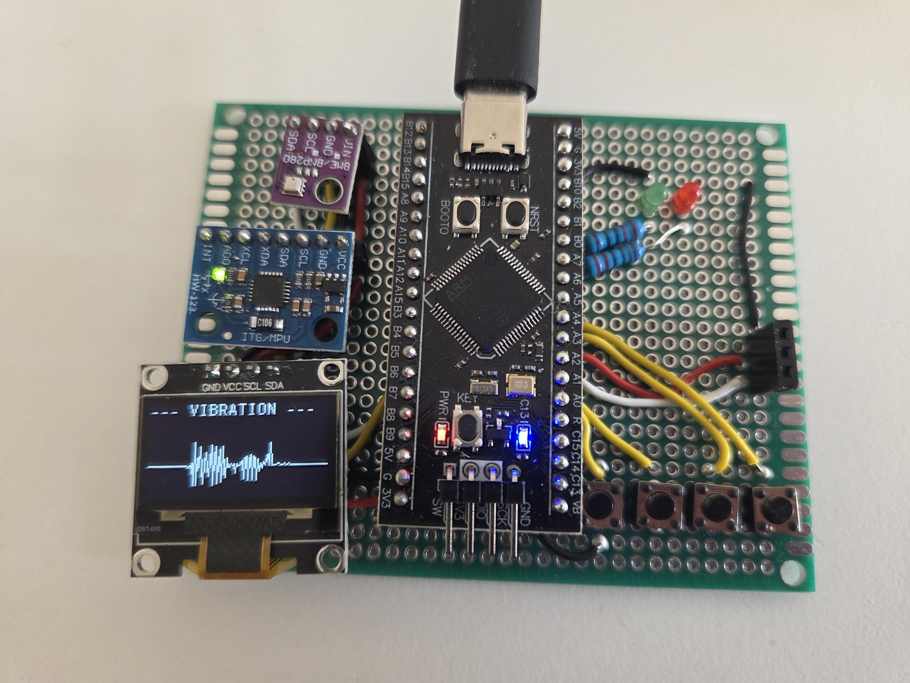

# STM32 FreeRTOS Monitoring System
An embedded monitoring system based on the STM32F401 microcontroller and FreeRTOS. The system combines environmental sensing, vibration monitoring, a graphical user interface, alarm management, and persistent user configuration.

## Features
### Real-Time Operating System
- Multi-task architecture based on FreeRTOS
- Separate tasks for sensor acquisition, display updates, user interface handling, and alarm monitoring
- Mutex-protected access to shared resources

### Sensor Monitoring
#### BME280
- Temperature measurement
- Humidity measurement
- Pressure measurement

#### MPU6050
- Acceleration measurement on all three axes
- Configurable sensitivity range
- Real-time vibration monitoring

### User Interface
- SSD1306 OLED display
- Multiple display pages:
- Environmental data
- Acceleration data
- Live vibration graph
- Four interrupt-driven push buttons for navigation

### Alarm System
- Configurable temperature alarm threshold
- Configurable vibration alarm threshold
- Immediate alarm indication on the display
- Integrated red status LED activated during alarm conditions
 
### Configuration Menu
User-configurable parameters:
- Temperature alarm threshold
- Vibration alarm threshold
- MPU6050 sensitivity range

### Persistent Storage
- Non-volatile configuration storage in internal STM32 Flash memory
- Automatic restoration of user settings after power cycling

### Communication & Synchronization
- Sensor communication via I²C
- Mutex-protected access to:
- I²C bus
- Shared global variables

## Hardware
- STM32F401
- BME280 Environmental Sensor
- MPU6050 Accelerometer/Gyroscope
- SSD1306 OLED Display
- Four push buttons
- On-board status LED

## Software Stack
- STM32 HAL
- FreeRTOS
- C

## Demonstrated Concepts
- Embedded software architecture
- Real-time systems
- Task scheduling
- Inter-task synchronization
- Interrupt handling
- Sensor integration
- User interface design
- Persistent data storage
- Alarm management
